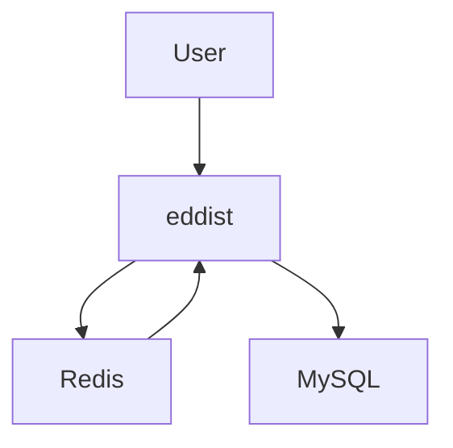

# Eddist
Anonymous BBS System running on Container

## Features
- Simple threadfloat BBS
- TODO: rich management page

## Architecture

```mermaid
flowchart
  U[User]
  R[Redis]
  DB[MySQL]
  E[eddist]

  U --> E
  E --> R
  R --> E
  E --> DB
```

## Usage
TODO

## License
AGPL v3
