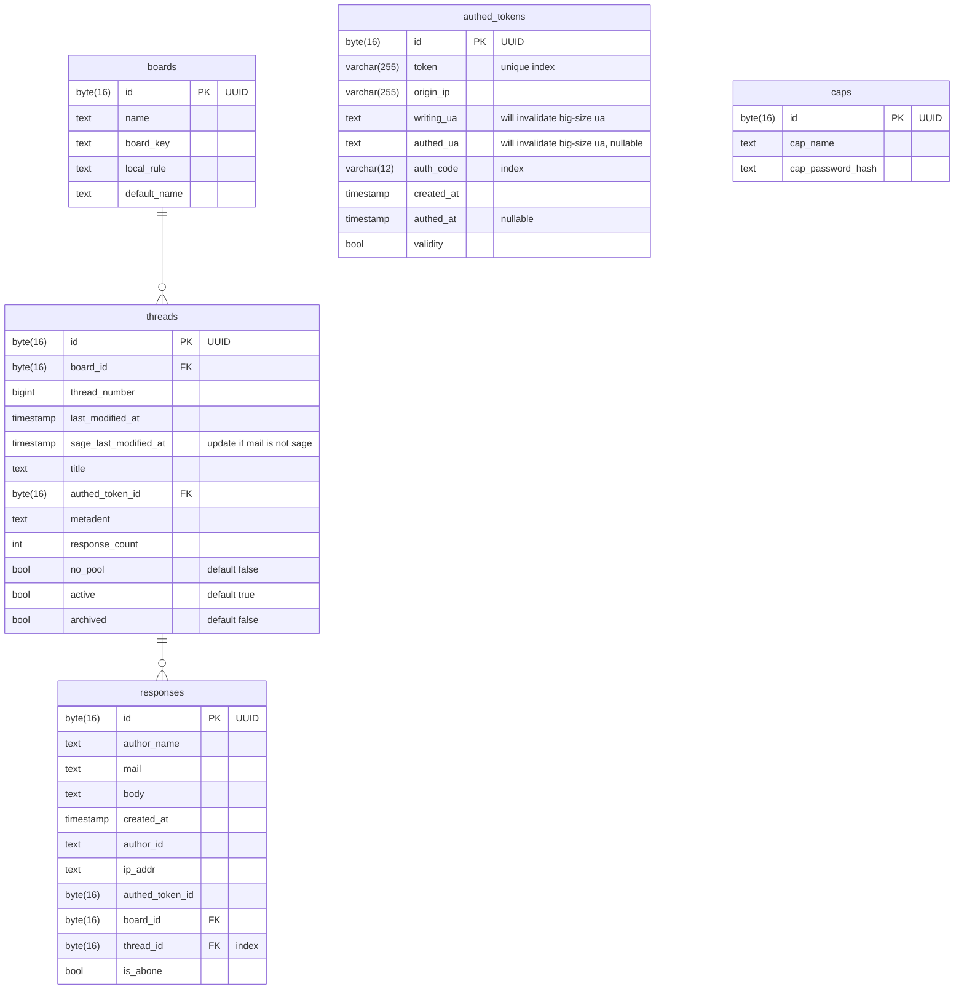

```mermaid
erDiagram
    boards {
        byte(16) id PK "UUID"
        text name
        text board_key
        text local_rule
        text default_name
    }

    threads {
        byte(16) id PK "UUID"
        byte(16) board_id FK
        bigint thread_number
        timestamp last_modified_at
        timestamp sage_last_modified_at "update if mail is not sage"
        text title
        byte(16) authed_token_id FK
        text metadent
        int response_count
        bool no_pool "default false"
        bool active "default true"
        bool archived "default false"
    }

    responses {
        byte(16) id PK "UUID"
        text author_name
        text mail
        text body
        timestamp created_at
        text author_id
        text ip_addr
        byte(16) authed_token_id
        byte(16) board_id FK
        byte(16) thread_id FK "index"
        bool is_abone 
    }

    authed_tokens {
        byte(16) id PK "UUID"
        varchar(255) token "unique index"
        varchar(255) origin_ip
        text writing_ua "will invalidate big-size ua"
        text authed_ua "will invalidate big-size ua, nullable"
        varchar(12) auth_code "index"
        timestamp created_at
        timestamp authed_at "nullable"
        bool validity 
    }

    %% cap feature is not required in initial version
    caps {
        byte(16) id PK "UUID"
        text cap_name
        text cap_password_hash
    }

    boards ||--o{ threads : ""
    threads ||--o{ responses : ""
```