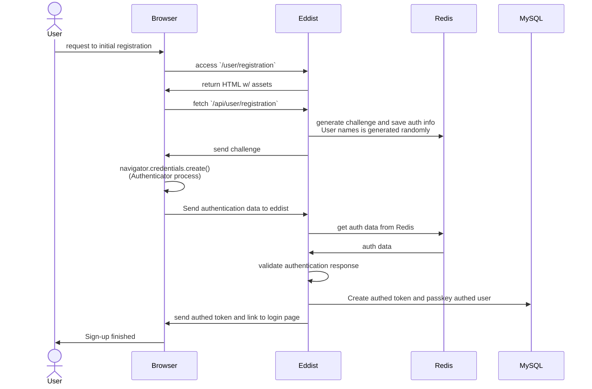
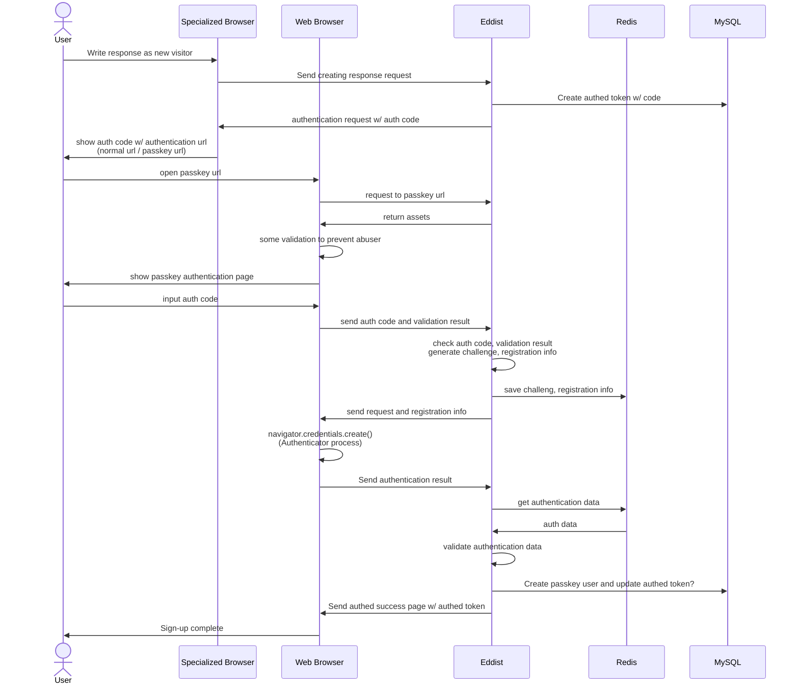
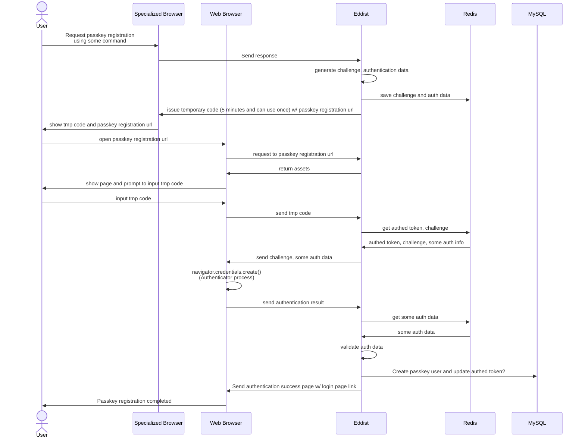

# User registration using (and only using) passkey

## Background
Currently, users can post to this system after authenticate the validaty using captcha.
After the authentication, user agent has cookie authed token which is necesarry to check the validity of the user when they want to post.

But, this token is device bound, thus we need to fix to be not device bounded.

## User model
Passkey user account (i.e., user account) is intended to indicate only one user.
User account able to have many passkeys, authed tokens.
User can have only one ID on a board day by day, and this should not affected by multiple authed tokens.
In most cases, authed tokens does not connect to user account.

When user want to register passkey at first time, eddist create passkey user automatically. This user account has randomly generated user name which user can change later.

## Implementation
We use passkey as simple user registration system (and can avoid some abusing).
There are some registration method,
1. Use passkey as initial registration, then create authed token (use in mail ONLY ONCE)
2. Use auth-code as initial registration. After authentication, user register own passkey
3. Already registrated some method, and user register passkey to associate authed token

and they have priority, we implement 3 at first, and 2 to 1.

### 1: Use passkey as initial registration

### 2: Use auth-code as initial registration

### 3: Already registered using some method

## Need components for passkey implementation

### Core components
- Login page
- Management page
    - management passkey
    - management authed token
        - should be able to register plan3 using tmp code
- Passkey registration page
    - Plan 1~3

### Additional components
TODO
