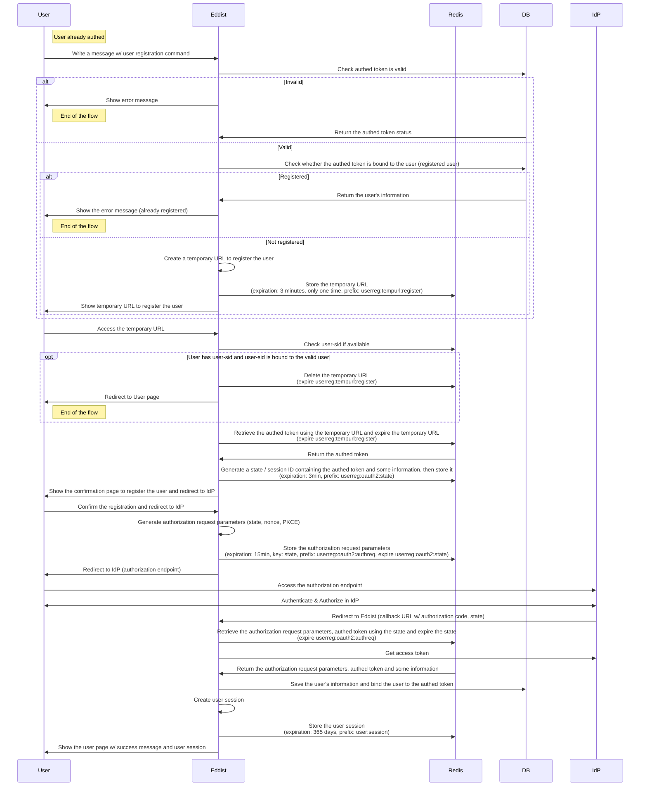
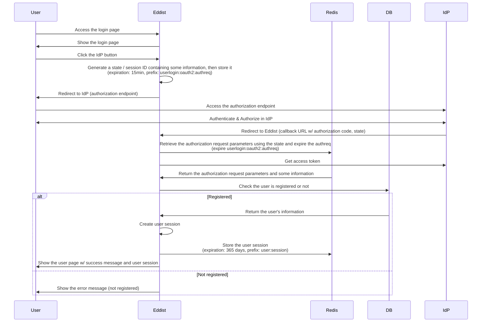
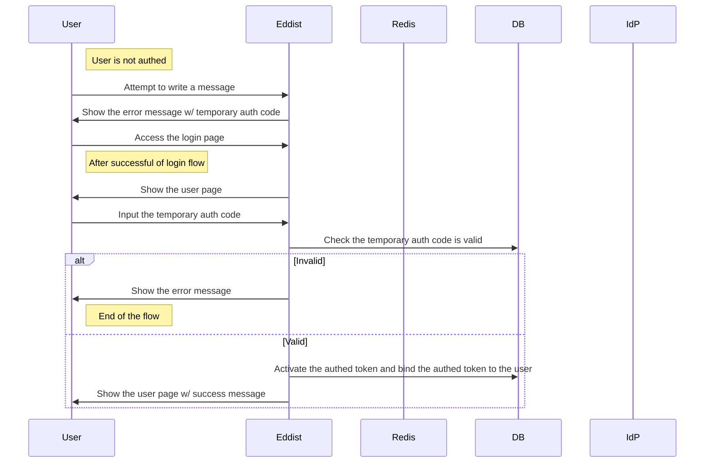
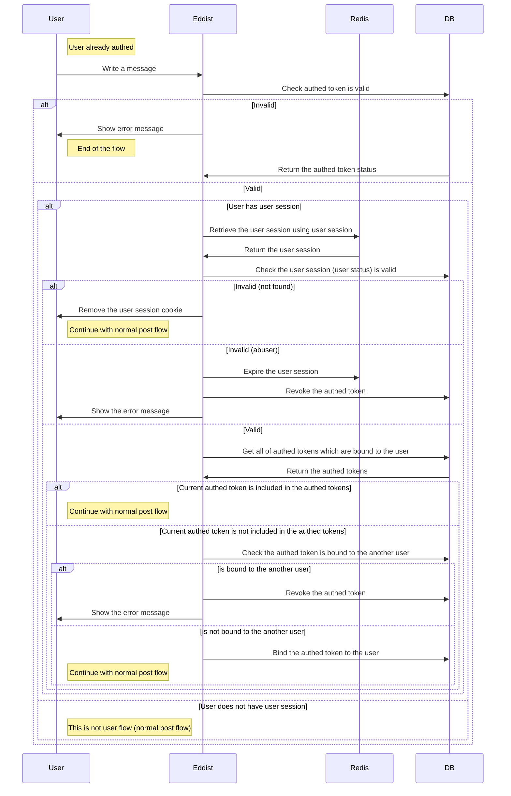
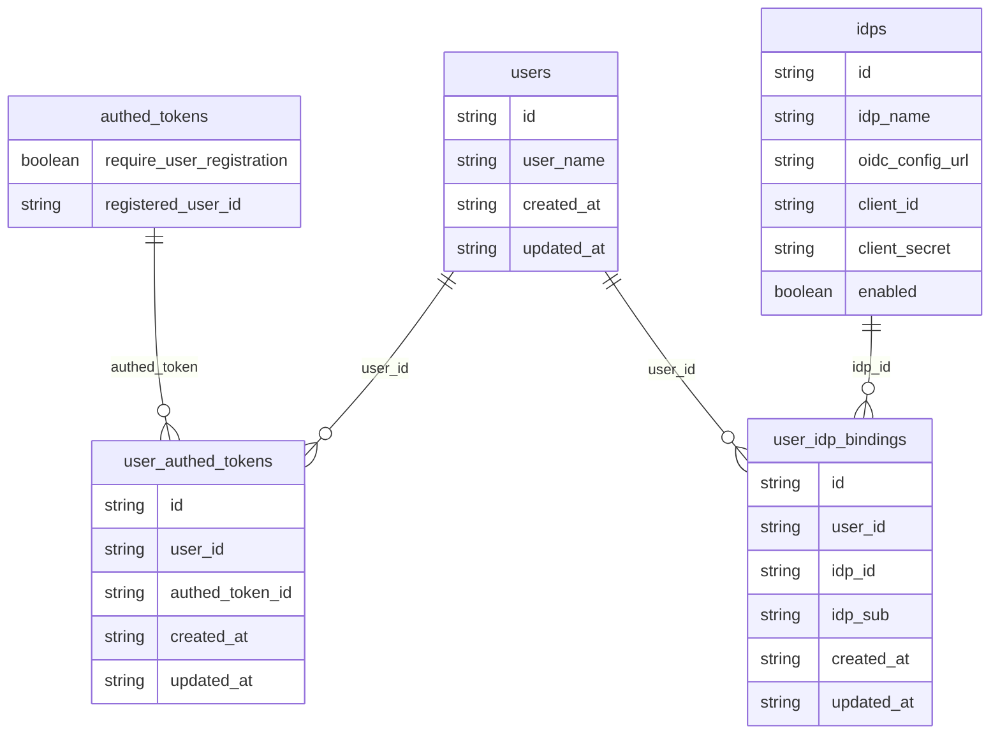

# Abstract
This document details the design of the user registration system for Eddist. 
Registered users authenticate via third-party IdPs (OAuth 2.0/OpenID Connect) without local passwords. 
A secure registration flow is triggered by a message command, leveraging cryptographically generated temporary URLs and state parameters. 
The system binds authed tokens to user accounts and manages user sessions for message posting, ensuring robust user identity management.

# Background
Currently, the user need to auth to post a message. But auth system which only depends on the token is not enough, because below reasons:
- The user is hard to remember the token, so the user need to memorize the token or save the token in some place to use the token another device.
- We want to revoke the token which is used for abuse, so user registration system is beneficial to distinguish the user is abuser or not.

# Specification
## Abstract
- User registration system is not required to post a message currently
- We will provide some features only for registered user
- User registration system use only third-party IdP to authenticate the user
  - OAuth 2.0 / OpenID Connect compatible IdP is supported
  - We does not store the user's password because of this choice
  - We support multiple IdP to authenticate the user
    - User can login one of the IdP which is supported by Eddist and registered by the user
- User auth first, then the user can register using user registration process
  - User registration process can begin from writing a message including the some specific command
- We will add flag whether enable this feature or not for while
  - We will create beta env in the future, and test it, then we will enable it in the production env

## Sequence Diagram of User Registration / Management
### Registration Flow

### Login flow

### Authentication w/ Login flow

### Post flow
TODO: need to further discussion

## ER Diagram associated with User Registration / Management

## URL / API Endpoints
- `/user/register/{tempurl}`: Show the user registration page
- `/user/register/authz/idp/{idp_name}`: Generate the authorization request parameters and redirect to IdP
- `/user/auth/callback`: Callback URL for IdP
- `/user/`: User page
- `/user/login`: Login page
- `/user/login/authz/idp/{idp_name}`: Generate the authorization request parameters and redirect to IdP
- `/user/logout`: Logout page (if possible)
