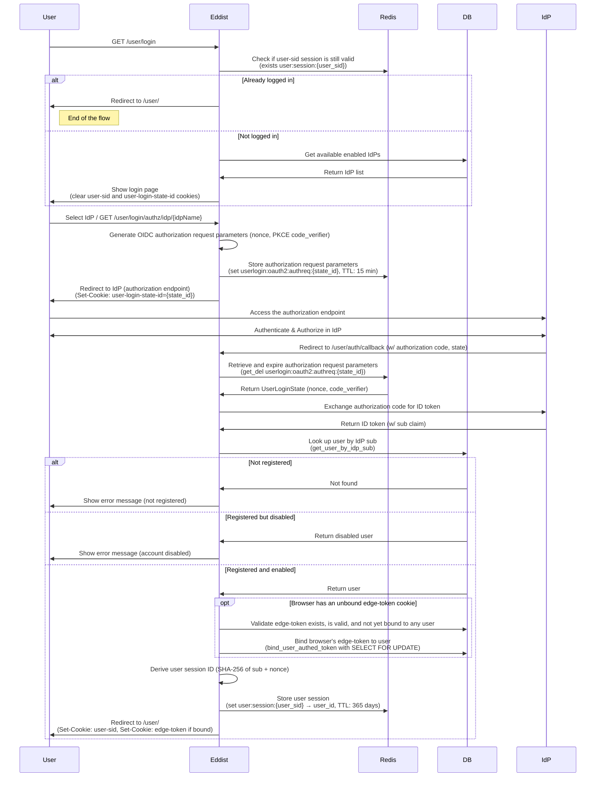
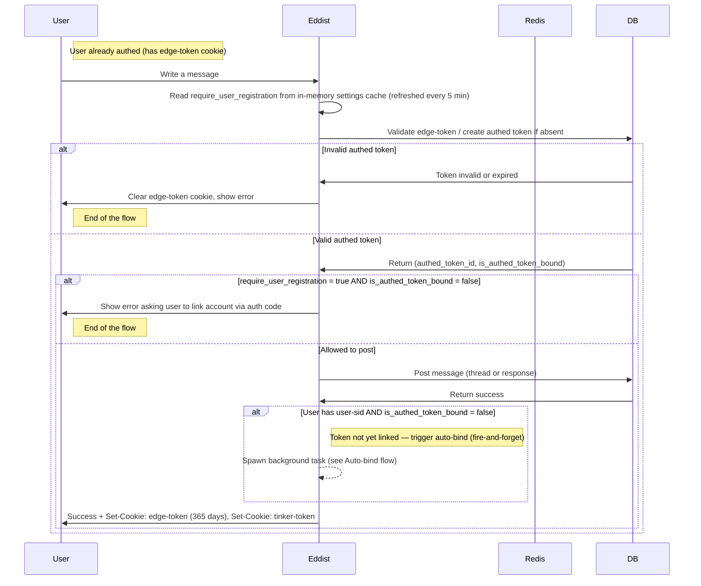
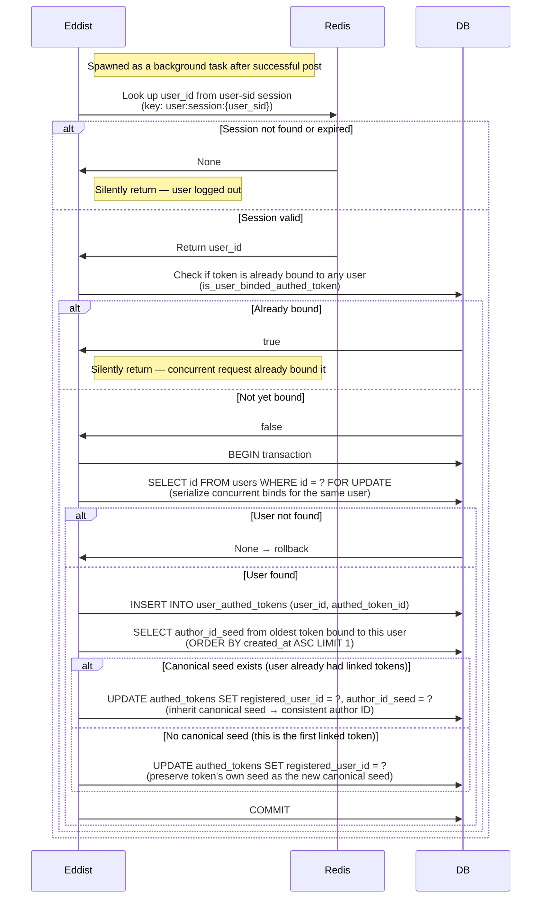
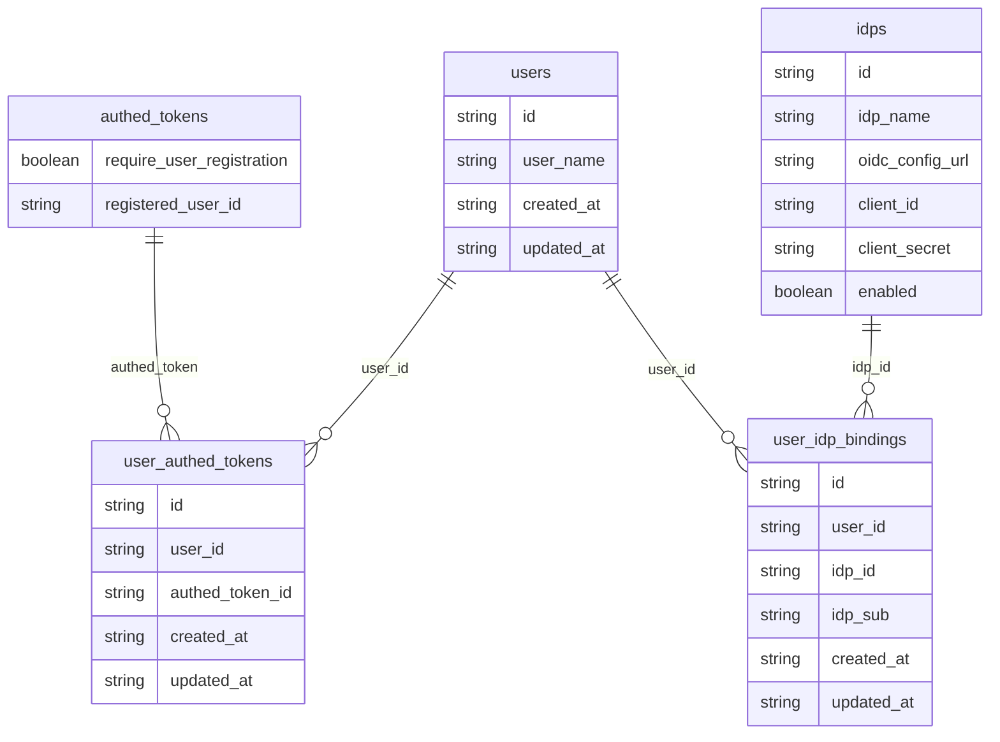

# Abstract
This document details the design of the user registration system for Eddist. 
Registered users authenticate via third-party IdPs (OAuth 2.0/OpenID Connect) without local passwords. 
A secure registration flow is triggered by a message command, leveraging cryptographically generated temporary URLs and state parameters. 
The system binds authed tokens to user accounts and manages user sessions for message posting, ensuring robust user identity management.

# Background
Currently, the user need to auth to post a message. But auth system which only depends on the token is not enough, because below reasons:
- The user is hard to remember the token, so the user need to memorize the token or save the token in some place to use the token another device.
- We want to revoke the token which is used for abuse, so user registration system is beneficial to distinguish the user is abuser or not.

# Specification
## Abstract
- User registration is not required to post by default; controlled by server settings
  - `EnableIdpLinking`: enables the `!userreg` command and shows a registration URL after auth code activation
  - `RequireIdpLinking`: enforces registration — any post from an unlinked token is blocked with a registration URL
- We will provide some features only for registered users
- User registration uses only third-party IdPs (OAuth 2.0 / OpenID Connect)
  - No local passwords are stored
  - Multiple IdPs are supported; users can log in with any IdP they have registered
- User authenticates first (via auth code), then links their token to an IdP account
  - Voluntary: user writes a message with `!userreg` as the body (requires `EnableIdpLinking`)
  - Enforced: any post attempt is blocked with a registration URL when `RequireIdpLinking` is enabled and the token is not yet linked

## Sequence Diagram of User Registration / Management
### Registration Flow
There are two ways to trigger the registration flow:

**Voluntary (`!userreg` command):** User writes a message with body starting with `!userreg` while `EnableIdpLinking` server setting is true. Rate-limited to 5 attempts per hour per token.

**Enforced (`require_user_registration` flag):** The authed token has `require_user_registration=true` (set when the token was issued after `RequireIdpLinking` was enabled). Any post attempt is blocked until the user registers.

```mermaid
sequenceDiagram
    participant User
    participant Eddist
    participant Redis
    participant DB
    participant IdP

    Note right of User: User is authed (has valid edge-token) but not yet linked to an account
    User->>Eddist: Write a message
    Eddist->>DB: Validate edge-token
    DB->>Eddist: Return authed token

    alt Body starts with "!userreg" AND EnableIdpLinking = true (voluntary)
        Eddist->>Eddist: Check rate limit (5 attempts / hour per token)
        alt Rate limit exceeded
            Eddist->>User: Show error (too many attempts)
            Note right of User: End of the flow
        else Within rate limit
            alt Token already linked to a user
                Eddist->>User: Show error (already registered)
                Note right of User: End of the flow
            else Token not linked
                Eddist->>Eddist: Generate random 5-char temp URL path
                Eddist->>Redis: Store authed_token_id under temp URL <br> (set userreg:tempurl:register:{path} → authed_token_id, TTL: 3 min)
                Eddist->>User: Show registration URL <br> (/user/register/{path})
            end
        end
    else require_user_registration = true on token AND token not linked (enforced)
        alt Token already linked to a user
            Eddist->>User: Show error (already registered)
            Note right of User: End of the flow
        else Token not linked
            Eddist->>Eddist: Generate random 5-char temp URL path
            Eddist->>Redis: Store authed_token_id under temp URL <br> (set userreg:tempurl:register:{path} → authed_token_id, TTL: 3 min)
            Eddist->>User: Show error with registration URL <br> (/user/register/{path})
        end
    end

    User->>Eddist: GET /user/register/{tempUrlPath}
    Eddist->>Redis: Retrieve authed_token_id and expire the temp URL <br> (get_del userreg:tempurl:register:{tempUrlPath}, TTL: 3 min)
    alt Temp URL not found or expired
        Redis->>Eddist: None
        Eddist->>User: Show error message (URL expired)
        Note right of User: End of the flow
    else Temp URL valid
        Redis->>Eddist: Return authed_token_id
        alt User already has a valid user-sid cookie
            Eddist->>Redis: Verify user session <br> (user:session:{user_sid})
            Redis->>Eddist: Return user_id
            Eddist->>DB: Bind authed_token to existing user <br> (bind_user_authed_token with SELECT FOR UPDATE)
            Eddist->>User: Redirect to /user/
            Note right of User: End of the flow
        else No valid user session
            Eddist->>DB: Get available enabled IdPs
            DB->>Eddist: Return IdP list
            Eddist->>Redis: Store registration state containing authed_token_id <br> (set userreg:oauth2:state:{state_id}, TTL: 3 min)
            Eddist->>User: Show IdP selection page <br> (Set-Cookie: userreg-state-id={state_id})
        end
    end

    User->>Eddist: Select IdP / GET /user/register/authz/idp/{idpName}
    Eddist->>Redis: Retrieve and expire registration state <br> (get_del userreg:oauth2:state:{state_id})
    Redis->>Eddist: Return UserRegState (authed_token_id)
    Eddist->>Eddist: Generate OIDC authorization request parameters (nonce, PKCE code_verifier)
    Eddist->>Redis: Store authorization request parameters <br> (set userreg:oauth2:authreq:{state_id}, TTL: 15 min)
    Eddist->>User: Redirect to IdP (authorization endpoint) <br> (Clear userreg-state-id cookie)
    User->>IdP: Access the authorization endpoint
    IdP<<->>User: Authenticate & Authorize in IdP
    IdP->>Eddist: Redirect to /user/auth/callback (w/ authorization code, state)
    Eddist->>Redis: Retrieve and expire authorization request parameters <br> (get_del userreg:oauth2:authreq:{state_id})
    Redis->>Eddist: Return UserRegState (authed_token_id, nonce, code_verifier)
    Eddist->>IdP: Exchange authorization code for ID token (w/ PKCE code_verifier)
    IdP->>Eddist: Return ID token (w/ sub claim)
    Eddist->>DB: Look up user by IdP sub <br> (get_user_by_idp_sub)
    alt User already registered with this IdP
        DB->>Eddist: Return existing user
        Eddist->>DB: Bind authed_token to existing user <br> (bind_user_authed_token with SELECT FOR UPDATE)
    else New user
        DB->>Eddist: Not found
        Eddist->>DB: Create new user and IdP binding <br> (users + user_idp_bindings)
        Eddist->>DB: Bind authed_token to new user <br> (bind_user_authed_token with SELECT FOR UPDATE)
    end
    opt Browser has a different unbound edge-token cookie
        Eddist->>DB: Bind browser's edge-token to user as well <br> (bind_user_authed_token with SELECT FOR UPDATE)
    end
    Eddist->>Eddist: Derive user session ID (SHA-256 of sub + nonce)
    Eddist->>Redis: Store user session <br> (set user:session:{user_sid} → user_id, TTL: 365 days)
    Eddist->>User: Redirect to /user/ <br> (Set-Cookie: user-sid, Set-Cookie: edge-token)
```

### Login flow

```mermaid
sequenceDiagram
    participant User
    participant Eddist
    participant Redis
    participant DB
    participant IdP

    User->>Eddist: GET /user/login
    Eddist->>Redis: Check if user-sid session is still valid <br> (exists user:session:{user_sid})
    alt Already logged in
        Eddist->>User: Redirect to /user/
        Note right of User: End of the flow
    else Not logged in
        Eddist->>DB: Get available enabled IdPs
        DB->>Eddist: Return IdP list
        Eddist->>User: Show login page <br> (clear user-sid and user-login-state-id cookies)
    end
    User->>Eddist: Select IdP / GET /user/login/authz/idp/{idpName}
    Eddist->>Eddist: Generate OIDC authorization request parameters (nonce, PKCE code_verifier)
    Eddist->>Redis: Store authorization request parameters <br> (set userlogin:oauth2:authreq:{state_id}, TTL: 15 min)
    Eddist->>User: Redirect to IdP (authorization endpoint) <br> (Set-Cookie: user-login-state-id={state_id})
    User->>IdP: Access the authorization endpoint
    IdP<<->>User: Authenticate & Authorize in IdP
    IdP->>Eddist: Redirect to /user/auth/callback (w/ authorization code, state)
    Eddist->>Redis: Retrieve and expire authorization request parameters <br> (get_del userlogin:oauth2:authreq:{state_id})
    Redis->>Eddist: Return UserLoginState (nonce, code_verifier)
    Eddist->>IdP: Exchange authorization code for ID token
    IdP->>Eddist: Return ID token (w/ sub claim)
    Eddist->>DB: Look up user by IdP sub <br> (get_user_by_idp_sub)
    alt Not registered
        DB->>Eddist: Not found
        Eddist->>User: Show error message (not registered)
    else Registered but disabled
        DB->>Eddist: Return disabled user
        Eddist->>User: Show error message (account disabled)
    else Registered and enabled
        DB->>Eddist: Return user
        opt Browser has an unbound edge-token cookie
            Eddist->>DB: Validate edge-token exists, is valid, and not yet bound to any user
            Eddist->>DB: Bind browser's edge-token to user <br> (bind_user_authed_token with SELECT FOR UPDATE)
        end
        Eddist->>Eddist: Derive user session ID (SHA-256 of sub + nonce)
        Eddist->>Redis: Store user session <br> (set user:session:{user_sid} → user_id, TTL: 365 days)
        Eddist->>User: Redirect to /user/ <br> (Set-Cookie: user-sid, Set-Cookie: edge-token if bound)
    end
```

### Post flow

```mermaid
sequenceDiagram
    participant User
    participant Eddist
    participant Redis
    participant DB

    Note right of User: User already authed (has edge-token cookie)
    User->>Eddist: Write a message
    Eddist->>Eddist: Read require_user_registration from in-memory settings cache (refreshed every 5 min)
    Eddist->>DB: Validate edge-token / create authed token if absent
    alt Invalid authed token
        DB->>Eddist: Token invalid or expired
        Eddist->>User: Clear edge-token cookie, show error
        Note right of User: End of the flow
    else Valid authed token
        DB->>Eddist: Return (authed_token_id, is_authed_token_bound)
        alt require_user_registration = true AND is_authed_token_bound = false
            Eddist->>User: Show error asking user to link account via auth code
            Note right of User: End of the flow
        else Allowed to post
            Eddist->>DB: Post message (thread or response)
            DB->>Eddist: Return success
            alt User has user-sid AND is_authed_token_bound = false
                Note right of Eddist: Token not yet linked — trigger auto-bind (fire-and-forget)
                Eddist-->>Eddist: Spawn background task (see Auto-bind flow)
            end
            Eddist->>User: Success + Set-Cookie: edge-token (365 days), Set-Cookie: tinker-token
        end
    end
```

### Auto-bind flow (background task)
Triggered after a successful post when the user is logged in (`user-sid` present) and the current edge-token is not yet linked to their account (`is_authed_token_bound = false`). This covers both posting with an existing unlinked token and posting with a brand-new token (e.g. when the user had no edge-token cookie).

```mermaid
sequenceDiagram
    participant Eddist
    participant Redis
    participant DB

    Note right of Eddist: Spawned as a background task after successful post
    Eddist->>Redis: Look up user_id from user-sid session <br> (key: user:session:{user_sid})
    alt Session not found or expired
        Redis->>Eddist: None
        Note right of Eddist: Silently return — user logged out
    else Session valid
        Redis->>Eddist: Return user_id
        Eddist->>DB: Check if token is already bound to any user <br> (is_user_binded_authed_token)
        alt Already bound
            DB->>Eddist: true
            Note right of Eddist: Silently return — concurrent request already bound it
        else Not yet bound
            DB->>Eddist: false
            Eddist->>DB: BEGIN transaction
            Eddist->>DB: SELECT id FROM users WHERE id = ? FOR UPDATE <br> (serialize concurrent binds for the same user)
            alt User not found
                DB->>Eddist: None → rollback
            else User found
                Eddist->>DB: INSERT INTO user_authed_tokens (user_id, authed_token_id)
                Eddist->>DB: SELECT author_id_seed from oldest token bound to this user <br> (ORDER BY created_at ASC LIMIT 1)
                alt Canonical seed exists (user already had linked tokens)
                    Eddist->>DB: UPDATE authed_tokens SET registered_user_id = ?, author_id_seed = ? <br> (inherit canonical seed → consistent author ID)
                else No canonical seed (this is the first linked token)
                    Eddist->>DB: UPDATE authed_tokens SET registered_user_id = ? <br> (preserve token's own seed as the new canonical seed)
                end
                Eddist->>DB: COMMIT
            end
        end
    end
```

## ER Diagram associated with User Registration / Management

```mermaid
erDiagram
    %% authed_tokens is already defined, so we does not write the definition here
    authed_tokens {
        %% ony added fields
        boolean require_user_registration
        string registered_user_id
    }
    users {
        string id
        %% user_name is optional, user can set the user name after registration
        string user_name
        string created_at
        string updated_at
    }
    user_authed_tokens {
        string id
        string user_id
        string authed_token_id
        string created_at
        string updated_at
    }
    user_idp_bindings {
        string id
        string user_id
        string idp_id
        string idp_sub
        string created_at
        string updated_at
    }
    idps {
        string id
        string idp_name
        string oidc_config_url
        string client_id
        %% client_secret is encrypted using ChaCha20-Poly1305
        string client_secret
        boolean enabled
    }

    users ||--o{ user_authed_tokens: user_id
    users ||--o{ user_idp_bindings: user_id    
    authed_tokens ||--o{ user_authed_tokens: authed_token
    idps ||--o{ user_idp_bindings: idp_id
```

## URL / API Endpoints
- `GET /user/`: User page
- `GET /user/register/{tempurl}`: Show the IdP selection page for registration (temp URL from `!userreg` or enforced flow)
- `GET /user/register/authz/idp/{idp_name}`: Generate OIDC authorization request and redirect to IdP
- `GET /user/login`: Login page
- `GET /user/login/authz/idp/{idp_name}`: Generate OIDC authorization request and redirect to IdP
- `GET /user/auth/callback`: OAuth2/OIDC callback — handles both registration and login redirects
- `POST /user/logout`: Logout (invalidates user session)
